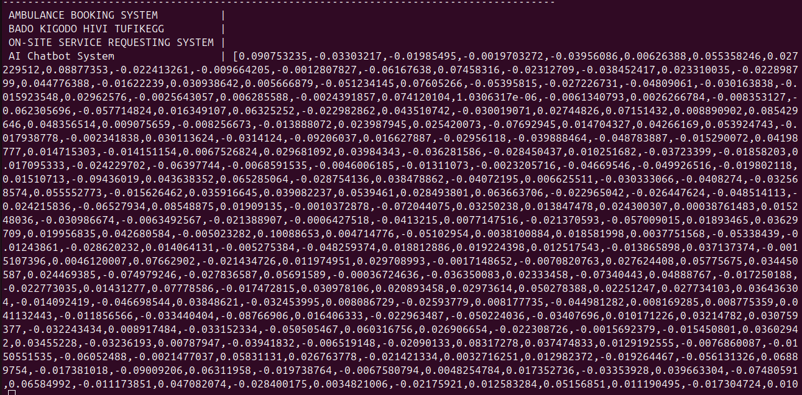

# UNIVERSITY FINAL YEAR PROJECT MANAGEMENT SYSTEM

**TL;DR:** Automates duplicate-checking and mentor assignment for final-year projects using hybrid similarity detection (embeddings + full-text search) and configurable admin controls.

## Quick Links
- [Quick Start](#quick-start) - Get running in 5 min
- [Project Structure](#project-structure) - Django app organization
- [Key Features](#key-features) - Core functionality
- [Architecture](#architecture--tech-stack) - Tech stack
- [Testing](#testing-embedding-generation--working) - Verify embeddings
- [Configuration](#configuration) - Settings & tuning
- [Contributing](#contributing) - Development guidelines

## User Roles

- **Students**: Create projects, assigned to a mentor (one-to-many relationship)
- **Mentors**: Supervise students and their projects
- **Coordinators**: Manage all mentors and system configuration

## Project Structure

The project follows a modular Django architecture with separate apps for different domains:

```
fypms/
├── accounts/
│   ├── models.py
│   ├── views.py
│   ├── admin.py
│   ├── apps.py
│   ├── tests.py
│   └── migrations/
├── projects/
│   ├── models.py
│   ├── utils.py
│   ├── utils_minimal.py
│   ├── similarity.py
│   ├── views.py
│   ├── admin.py
│   ├── apps.py
│   ├── tests.py
│   ├── tests/
│   │   ├── test_similarity.py
│   │   ├── test_utils.py
│   │   ├── test_utils_simple.py
│   │   └── __init__.py
│   ├── management/
│   │   └── commands/
│   │       ├── generate_embeddings.py
│   │       └── __init__.py
│   └── migrations/
├── api/
│   ├── views.py
│   ├── serializers.py
│   ├── urls.py
│   ├── admin.py
│   ├── apps.py
│   ├── tests.py
│   ├── models.py
│   └── migrations/
├── core/
│   ├── middleware.py
│   ├── models.py
│   ├── views.py
│   ├── admin.py
│   ├── apps.py
│   ├── tests.py
│   └── migrations/
├── fypms/
│   ├── settings.py
│   ├── urls.py
│   ├── wsgi.py
│   ├── asgi.py
│   ├── __init__.py
│   └── management/
├── frontend/
│   ├── src/
│   │   ├── App.js
│   │   ├── index.js
│   │   ├── assets/
│   │   ├── context/
│   │   ├── pages/
│   │   └── services/
│   ├── public/
│   ├── package.json
│   └── README.md
├── docs/
│   ├── DUPLICATEDETECTOR_ROADMAP.md
│   ├── TODO.md
│   └── duplicacte8todos.md
├── .env
├── .env.example
├── .gitignore
├── manage.py
├── requirements.txt
├── schema.sql
├── test_embeddings.py
├── verify_embeddings.py
├── test_api.py
├── test_http_api.py
└── README.md
```

### App Overview

- **accounts**: User authentication, roles, and permissions
- **projects**: Projects, embeddings, and duplicate detection
- **api**: REST API endpoints for all operations
- **core**: Shared utilities and middleware

## Quick Start

**Prerequisites:** Python 3.8+, PostgreSQL with pgvector and pg_trgm extensions, pip/virtualenv

```bash
python -m venv venv
venv\Scripts\activate               # Windows
# source venv/bin/activate          # Linux/macOS

pip install -r requirements.txt
python manage.py migrate
python manage.py createsuperuser
python manage.py runserver          # http://localhost:8000
```

> **If `pip install -r requirements.txt` fails:** Install packages one by one from `requirements.txt` as fallback (some dependencies may require system libraries or special compilation steps).

**Test the API:**
```bash
curl -X POST http://localhost:8000/api/projects \
  -H "Content-Type: application/json" \
  -d '{
    "title": "AI-powered Chat Bot",
    "objectives": "Implement NLP-based chatbot using transformer models.",
    "student_name": "John Doe"
  }'
```

**Expected Response:**
```json
{
  "id": 1,
  "title": "AI-powered Chat Bot",
  "objectives": "Implement NLP-based chatbot using transformer models.",
  "status": "proposed",
  "duplicates": [],
  "mentor_assignment": null
}
```

## Key Features

- **Embedding Generation**: Automatic 768-dimensional vectors using Sentence-BERT when projects are created
- **Duplicate Detection**: Hybrid similarity scoring (semantic + lexical) with configurable thresholds
- **Project Management**: Support for group projects, multiple statuses, and project types
- **Role-Based Access**: Student, Mentor, and Coordinator roles with appropriate permissions
- **Auto-Mentor Assignment**: Load-balanced assignment with manual override capability

## Architecture & Tech Stack

| Component | Technology |
|-----------|-------------|
| **Frontend** | Bootstrap (HTML/CSS/JS) |
| **Backend** | Django + DRF (REST API) |
| **Database** | PostgreSQL + pgvector extension |
| **Embeddings** | Sentence-BERT (SBERT) for semantic similarity |
| **Full-text Search** | PostgreSQL GIN indexes (TF-IDF style) |
| **Vectorization** | TF-IDF + SBERT + Levenshtein (hybrid) |

## Data Model

### Core Entities

| Entity | Key Fields | Notes |
|--------|-----------|-------|
| **Student** | id, name, email, reg_no, course_id, mentor_id, created_at | Foreign key to mentor |
| **Mentor** | id, name, email, created_at | Can be admin; manages multiple students |
| **Project** | id, title, project_type, main_objective, specific_objectives, project_description, implementation_details, year, status, created_at, *_embedding (VECTOR), last_similarity_check | Status: proposed, approved, rejected, completed |
| **Project_Student** | id, project_id, student_id, role, joined_at | Links students to group projects; role: lead/member |

### Indexes for Performance

- **Full-text GIN indexes** on `title` and `objectives` for lexical search.
- **IVFFlat vector indexes** on `*_embedding` columns for fast approximate nearest-neighbor search.
- **Partial indexes** on recent/active projects (year >= current_year - 3).
- **Composite indexes** on (course_id, mentor_id), (project_id, role) for common queries.

## Duplicate Detection Design

**Core Pipeline:**
1. Project submitted → embeddings generated (Sentence-BERT, 768-dim)
2. Vector similarity search against existing projects (pgvector)
3. Combine semantic + lexical scores
4. Apply thresholds:
   - Score < 0.6: Auto-approve
   - 0.6 ≤ score < 0.8: Flag for admin review
   - Score ≥ 0.8: Auto-flag as duplicate

**Configuration:**
```python
DUPLICATE_SIMILARITY_THRESHOLD = 0.6      # Flag for review
DUPLICATE_AUTO_FLAG_THRESHOLD = 0.8       # Auto-flag
SEMANTIC_WEIGHT = 0.7                     # 70% semantic, 30% lexical
SEARCH_YEARS_BACK = 3                     # Check last 3 years
```

See [docs/DUPLICATEDETECTOR_ROADMAP.md](docs/DUPLICATEDETECTOR_ROADMAP.md) for detailed algorithm design and optimization strategies.

## APIs and Endpoints (suggested)

These are suggested REST endpoints for a backend service. Adjust to your chosen framework.

- `POST /api/projects` — create a project (store project + compute & store embeddings).
- `GET /api/projects/{id}/duplicates?years_back=3&threshold=0.75` — returns potential duplicates with scores.
- `POST /api/projects/check-duplicates` — realtime check for an input title/objectives.
- `POST /api/assignments/auto-assign` — auto-assign mentors for unassigned projects.
- `GET /api/mentors/{id}/students` — returns students assigned to that mentor.
- `GET /api/admin/settings` and `PUT /api/admin/settings` — admin settings (years_back, thresholds).

**Authentication & Authorization:**

- Protect admin APIs with role-based auth (JWT/OAuth). Student endpoints limited to their own data.

## Configuration

Key configurable parameters:

- `DUPLICATE_SEARCH_YEARS_BACK` (int, default: 3) — How many years back to search for duplicates
- `DUPLICATE_SIMILARITY_THRESHOLD` (float 0..1, default: 0.6) — Threshold to flag for admin review
- `DUPLICATE_AUTO_FLAG_THRESHOLD` (float 0..1, default: 0.8) — Threshold to auto-flag as duplicate
- `DUPLICATE_ALGORITHM` (enum: TFIDF|EMBEDDING|HYBRID, default: HYBRID) — Which algorithm to use
- `MENTOR_MAX_LOAD_DEFAULT` (int, default: 5) — Default max students per mentor
- `APPOINTMENT_ADVANCE_NOTICE_DAYS` (int, default: 5) — Min days to schedule appointment before review
- `EMBEDDING_MODEL` (string, default: sentence-transformers/all-MiniLM-L6-v2) — SBERT model for embeddings

Store these in environment variables or a secure settings file; never commit secrets to source control.

## Developer Setup & Run

**Prerequisites:**

- Python 3.8+
- PostgreSQL with pgvector extension
- pip and virtualenv

**Common commands:**

```bash
# from project root
python -m venv vee
vee\Scripts\activate  # Windows
# source vee/bin/activate  # Linux/Mac

pip install -r requirements.txt
python manage.py migrate
python manage.py createsuperuser
python manage.py runserver
```

**Local dev tips:**

- Use a small seed dataset to test duplicate detection logic.
- Add environment variables for database connection and API keys.

### Testing Embedding Generation ✅ WORKING

The embedding generation system is **fully implemented and tested**. Here's how to verify it's working:

**Quick Test (1 minute):**
```bash
# Run the embedding test script
python test_embeddings.py
```

This will:
1. Load the Sentence-BERT model (768-dimensional embeddings)
2. Generate test embeddings
3. Create a test project and verify embeddings are stored in the database
4. Display embedding dimensions and sample values

**Expected Output:**
```
✓ Embedding service loaded successfully
  Model: sentence-transformers/all-mpnet-base-v2
  Dimensions: 768
  
✓ Embeddings generated successfully
  combined_embedding: 768 dimensions
  [0.071721, -0.038723, ..., -0.026387]
  
✓ Embeddings stored in database!
```

**Output of "select title, title_embedding from projects_project;"**



**Generate Embeddings for Existing Projects:**
```bash
# Generate embeddings only for projects without them
python manage.py generate_embeddings

# Regenerate all embeddings (useful after model updates)
python manage.py generate_embeddings --all

# Generate for a specific project ID
python manage.py generate_embeddings --project-id 123
```

**Verify Embeddings in Database:**
```bash
# Verify embeddings stored in PostgreSQL
python verify_embeddings.py
```

**How It Works:**
1. When you submit a project via the API, a Django signal automatically triggers embedding generation
2. The `EmbeddingService` class uses Sentence-BERT to generate 768-dimensional vectors  
3. Embeddings for title, objectives, and combined text are stored in pgvector columns
4. Embeddings are ready for duplicate detection (next phase)

**Configuration:**
- Model: `sentence-transformers/all-mpnet-base-v2` (768 dimensions)
- Dimensions: 768 (stored in `combined_embedding`, `title_embedding`, `objectives_embedding`)
- Automatic: Generated on project creation/update via Django signals
- Batch: Use management command for bulk processing

**Troubleshooting:**
- If embeddings aren't generated: Check logs in `/logs/` directory
- Model download slow: First run downloads ~438MB model (cached after first use)
- Database connection error: Verify PostgreSQL pgvector extension: `CREATE EXTENSION IF NOT EXISTS vector;`

---

## Admin Guide

**Tuning Duplicate Detection:**
- Increase threshold to reduce false positives, decrease to catch more duplicates
- Set `DUPLICATE_SEARCH_YEARS_BACK` to control historical check window
- Monthly audits to refine thresholds based on feedback
- Start conservative, adjust based on results

**Best Practices:**
- Educate students on academic integrity policies
- Monitor duplicate flags and mentor loads regularly
- Maintain domain-specific stopword lists as needed

## Contributing

**Development Workflow:**
- Follow Django/Python style guidelines (use `black`, `flake8`)
- Submit PRs with tests for new features
- Document API changes and migration steps

## Further Reading & Documentation

For deep dives on vector indexing, threshold calibration, scaling strategies, and data retention policies, see the project's `docs/` folder or contact the maintainer.

## FAQ

**Q: Why precompute embeddings?**  
A: Precomputed embeddings enable sub-second lookup via vector indexes; computing per request is too slow for 10K+ projects.

**Q: Can I use TF-IDF only without embeddings?**  
A: Yes, set `DUPLICATE_ALGORITHM=TFIDF` in config. TF-IDF is lightweight but less effective at catching rephrases.

**Q: How often should I adjust thresholds?**  
A: Monthly; review flagged projects and adjust based on false positive/negative rates.

**Q: Can students dispute a duplicate flag?**  
A: Yes; implement an appeal workflow where students provide evidence and admins review.


---

**This system helps ensure academic integrity and reduces faculty workload by automating duplicate detection and mentor assignment for final-year projects.**

python manage.py makemigrations
python manage.py migrate